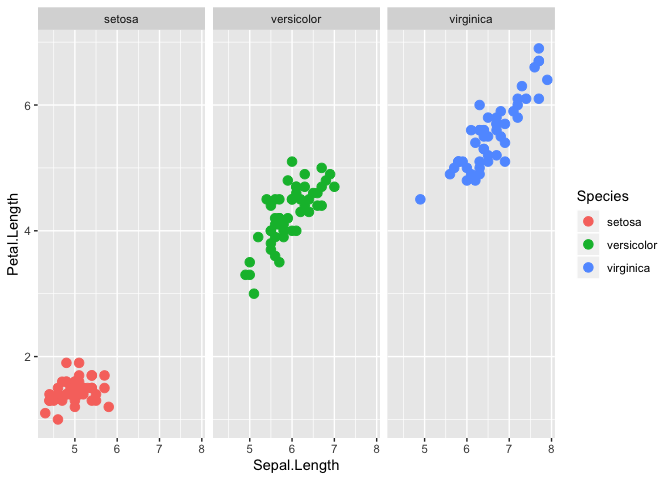

test.R
================
bdemarest
2020-01-27

Test r script.

``` r
library(ggplot2)

ggplot(iris, aes(x=Sepal.Length, y=Petal.Length, colour=Species)) +
  geom_point(size=3) +
  facet_grid(. ~ Species)
```

<!-- -->
